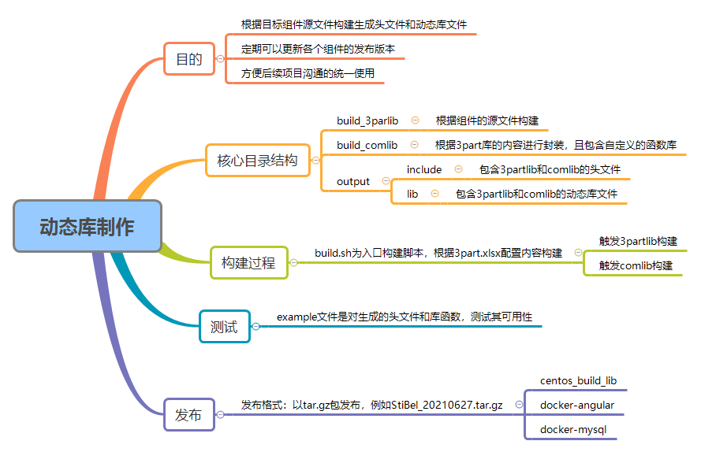

# build_lib

用于编译生成第三方库的头文件和so，进一步二次封装成个人库，便于统一使用。

## 整体框架

 


## 主要构建逻辑

1. 通过build.sh脚本执行第三方库和个人库的build过程。
2. build_3partlib中包含多个文件夹，文件夹内是对应库的源文件。
3. build_3partlib.sh 是第三方库的生成的主要脚本，3partlib_config是配置文件，其中build_list配置了所需要生成的库文件名
4. build_comlib中包含StiBel个人库的源文件,包含Common、Data、JSON等，主要是对现有库进行二次封装，便于使用。其中comlib_config是配置文件，其中build_list配置了所需要生成的库文件名。
5. 最终生成的头文件和so文件，会放到include/3partlib(comlib)、lib/3partlib(comlib) 中，并最终打包成 StiBel_20210627.tar.gz 格式的文件。

## 编译环境要求

* gcc : 9.1.0
* Python : 3.7.10
* cmake : 3.14.5

## 容器方式构建

容器构建方式，主要依赖构建镜像:docker.io/klc407073648/centos_build_lib:v3.0,里面已经集成构建所需依赖。

具体执行过程:
```
cd /home/myprj/

git clone git@github.com:klc407073648/build_lib.git

docker run -it -d -v /home/myprj/build_lib:/home/tools/build_lib --name build_lib_0 docker.io/klc407073648/centos_build_lib:v3.0 /bin/bash

docker exec -it build_lib_0 bash

cd /home/tools/build_lib/build

chmod 777 *.sh
dos2unix *.sh

./build.sh
```

## 生成动态库的使用方法

1. 解压文件到工程文件目录
    * tar zxf StiBel_20210406.tar.gz
2. 在CMakeLists.txt配置各个库的路径
3. 具体示例
    * 参考 examples下的CMakeLists.txt

## 

## 改进点

1. 考虑每次拉取最新的组件版本进行构建
   * 优点：组件的漏洞可以修复，同时最新组件有新特性可以使用
   * 缺点：拉取可能由于网络原因时间慢，且容易构建失败

2. 考虑xlrd的安装方式，采用离线安装
   * 原始使用`pip3 install -r requirements.txt` 安装python的组件，但是因网络原因不一定下载成功
   * 使用对应xlrd包源码直接安装

