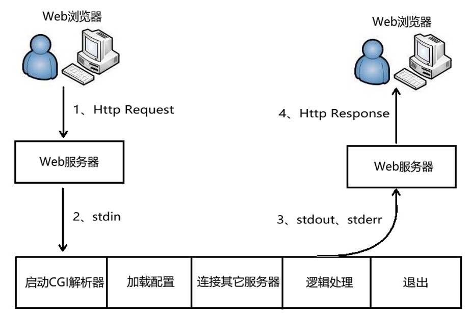
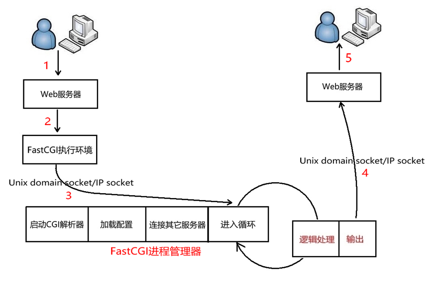

# FastCGI

# 概述

> CGI(common gateway interface)通用网关接口描述了**客户端和服务器程序之间传输数据**的⼀种标准，可以让⼀个客户端，从网页浏览器向执⾏在网络服务器上的程序请求数据。

CGI独⽴于任何语⾔的，CGI程序可以⽤任何脚本语⾔或者是完全独⽴编程语⾔实现，只要这个语⾔可以在这个系统上运⾏。Unix shell script、Python、 Ruby、PHP、 perl、Tcl、 C/C++和 Visual Basic 都可以⽤来编写CGI程序。

最初，CGI是在1993年由美国国家超级电脑应⽤中⼼(NCSA)为NCSA HTTPd Web服务器开发的。这个Web服务器使⽤了UNIX shell环境变量来保存从Web服务器传递出去的参数，然后⽣成⼀个运⾏CGI的独⽴的进程。

# CGI

## CGI处理流程




处理流程步骤: 

1.	web服务器收到客户端(浏览器)的请求Http Request，启动CGI程序，并通过环境变量、标准输入传递数据
2.	CGI进程启动解析器、加载配置(如业务相关配置)、连接其它服务器(如数据库服务器)、逻辑处理等
3.	CGI进程将处理结果通过标准输出、标准错误，传递给web服务器
4.	web服务器收到CGI返回的结果，构建Http Response返回给客户端，并杀死CGI进程

## 特点

1. web服务器与CGI**通过环境变量、标准输入、标准输出、标准错误互相传递数据**。在遇到用户连接请求：先要创建CGI子进程，然后CGI子进程处理请求，处理完事退出这个子进程：fork-and-execute

2. CGI方式是客户端有多少个请求，就开辟多少个子进程，每个子进程都需要启动自己的解释器、加载配置，连接其他服务器等初始化工作，这是CGI进程性能低下的主要原因。当用户请求非常多的时候，会占用大量的内存、cpu等资源，造成性能低下。

3. **CGI使外部程序与Web服务器之间交互成为可能**。CGI程序运行在独立的进程中，并对每个Web请求建立一个进程，这种方法非常容易实现，但效率很差，难以扩展。面对大量请求，进程的大量建立和消亡使操作系统性能大大下降。此外，由于地址空间无法共享，也限制了资源重用。

## 环境变量

GET请求，它将数据打包放置在环境变量QUERY_STRING中，CGI从环境变量QUERY_STRING中获取数据。

常见的环境变量如下表所示：

|环境变数|含义|
|---|---|
|AUTH_TYPE|存取认证类型|
|CONTENT_LENGTH|由标准输入传递给CGI程序的数据长度，以bytes或字元数来计算|
|CONTENT_TYPE|请求的MIME类型|
|GATEWAY_INTERFACE|服务器的CGI版本编号|
|HTTP_ACCEPT|浏览器能直接接收的Content-types, 可以有HTTP Accept|
|HTTP_USER_AGENT|递交表单的浏览器的名称、版本和其他平台性的附加信息|
|HTTP_REFERER|递交表单的文本的URL，不是所有的浏览器都发出这个信息，不要依赖它|
|PATH_INFO|传递给CGI程序的路径信息|
|QUERY_STRING|传递给CGI程序的请求参数，也就是用"?"隔开，添加在URL|
|REMOTE_ADDR|client端的host名称|
|REMOTE_HOST|client端的IP位址|
|REMOTE_USER|client端送出来的使用者名称|
|REMOTE_METHOD|client端发出请求的方法(如get、post)|
|SCRIPT_NAME|CGI程序所在的虚拟路径，如/cgi-bin/echo|
|SERVER_NAME|server的host名称或IP地址|
|SERVER_PORT|收到request的server端口|
|SERVER_PROTOCOL|所使用的通讯协定和版本编号|
|SERVER_SOFTWARE|server程序的名称和版本|

## 标准输入

环境变量的大小是有一定的限制的，当需要传送的数据量大时，储存环境变量的空间可能会不足，造成数据接收不完全，甚至无法执行CGI程序。

因此后来又发展出另外一种方法：POST，也就是利用I/O重新导向的技巧，**让CGI程序可以由stdin和stdout直接跟浏览器沟通**。

当我们指定用这种方法传递请求的数据时，web服务器收到数据后会先放在一块输入缓冲区中，并且将数据的大小记录在CONTENT_LENGTH这个环境变量，然后调用CGI程序并将CGI程序的stdin指向这块缓冲区，于是我们就可以很顺利的通过stdin和环境变数CONTENT_LENGTH得到所有的信息，再没有信息大小的限制了。

# FastCGI

> 快速通用网关接口(Fast Common Gateway Interface, FastCGI)是通用网关接口(CGI)的改进，描述了客户端和服务器程序之间传输数据的一种标准。

FastCGI致力于减少Web服务器与CGI程式之间互动的开销，从而使服务器可以同时处理更多的Web请求。与为每个请求创建一个新的进程不同，**FastCGI使用持续的进程来处理一连串的请求**。这些进程由FastCGI进程管理器管理，而不是web服务器。

## FastCGI处理流程



处理流程步骤: 

1. Web 服务器启动时载入初始化FastCGI执行环境。 例如IIS、ISAPI、apache mod_fastcgi、nginx ngx_http_fastcgi_module、lighttpd、mod_fastcgi。

2. FastCGI进程管理器自身初始化，启动多个CGI解释器进程并等待来自Web服务器的连接。启动FastCGI进程时，可以配置以ip和UNIX 域socket两种方式启动。

3. 当客户端请求到达Web 服务器时， Web 服务器将请求采用socket方式转发FastCGI主进程，FastCGI主进程选择并连接到一个CGI解释器。Web 服务器将CGI环境变量和标准输入发送到FastCGI子进程。

4. FastCGI子进程完成处理后将标准输出和错误信息从同一socket连接返回Web 服务器。当FastCGI子进程关闭连接时，请求便处理完成。

5. FastCGI子进程接着等待并处理来自Web 服务器的下一个连接。

由于FastCGI程序**并不需要不断的产生新进程，可以大大降低服务器的压力并且产生较高的应用效率**。它的速度效率最少要比CGI 技术提高 5 倍以上。它还支持分布式的部署，即FastCGI 程序可以在web 服务器以外的主机上执行。

CGI 是所谓的**短生存期应用程序**，FastCGI 是所谓的**长生存期应用程序**。FastCGI像是一个常驻(long-live)型的CGI，它可以一直执行着，不会每次都要花费时间去fork一次(这是CGI最为人诟病的fork-and-execute 模式)。

## spawn-fcgi

Nginx不能像Apache那样直接执行外部可执行程序，但Nginx可以作为代理服务器，将请求转发给后端服务器，这也是Nginx的主要作用之一。其中Nginx就支持FastCGI代理，接收客户端的请求，然后将请求转发给后端FastCGI进程。

由于FastCGI进程由FastCGI进程管理器管理，而不是Nginx。这样就需要一个FastCGI进程管理器，管理我们编写FastCGI程序。

spawn-fcgi是一个通用的FastCGI进程管理器，简单小巧，原先是属于lighttpd的一部分，后来由于使用比较广泛，所以就迁移出来作为独立项目。

spawn-fcgi使用 pre-fork 模型，功能主要是打开监听端口，绑定地址，然后 fork-and-exec 创建我们编写的FastCGI应用程序进程，退出完成工作。FastCGI应用程序初始化，然后进入**死循环侦听socket的连接请求**。

# examples下的demo使用

路径: build_lib\examples\examples\3partlib\fastcgi


代码

```cpp
#include "fcgi_stdio.h"
#include <stdlib.h>

int main(void)
{
    int count = 0;
    while (FCGI_Accept() >= 0)
    {
        printf("Content-type: text/html\r\n"
               "\r\n"
               "<title>FastCGI Hello!</title>"
               "<h1>FastCGI Hello!</h1>"
               "Request number %d running on host <i>%s</i>\n",
               ++count, getenv("SERVER_NAME"));
    }
    return 0;
}
```

执行结果:

```
[root@5d4b980baaa2 3partlib]# ./fastcgi/fastcgiTest
Content-type: text/html

<title>FastCGI Hello!</title><h1>FastCGI Hello!</h1>Request number 1 running on host <i>(null)</i>
```


