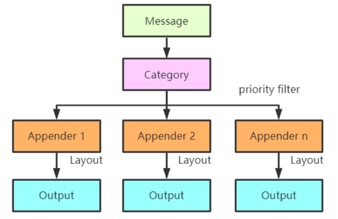

# log4cpp

# 参考资料

* [log4cpp官网](https://log4cpp.sourceforge.net/)
* [log4cpp浅析](https://blog.csdn.net/lyt_dawang/article/details/115612542)
* [log4cpp的类介绍](https://blog.csdn.net/qq_38973710/article/details/124207681)
* [log4cpp使用](https://blog.csdn.net/rain_qingtian/article/details/41849047)

# 概述

> Log4cpp是一个开源的C++类库，它提供了C++程序中使用日志和跟踪调试的功能，它的优点如下: 

* 提供应用程序运行上下文，方便跟踪调试；
* 可扩展的、多种方式记录日志，包括**命令行、文件、回卷文件、内存、syslog服务器、Win事件日志**等；
* 可以**动态控制日志记录级别**，在效率和功能中进行调整；
* 所有配置可以通过配置文件进行动态调整；

## 原理
      
Log4cpp有三个主要的组件: **日志类别(Category)、输出源(Appender)和布局(Layout)**。这三种类型的组件一起工作使得系统可以根据信息的类型和级别记录它们，并且在运行时控制这些信息的输出格式和位置。

三个组件的介绍: 

1. 日志类别(Category): 如果配置文件中设置的级别是DEBUG，则任意的log都能打印出来；但如果配置的级别是ERROR,则只有高于ERROR优先级的日志才可以打印出来。
  * 日志的常用优先级: DEBUG < INFO < WARN < ERROR < FATAL

2. 输出源(Appender): 用来输出日志(被layout格式化后)到一些设备上，比如文件、命令行、内存等。

```cpp
log4cpp::IdsaAppender // 发送到IDS或者logger, 详细见 http://jade.cs.uct.ac.za/idsa/
log4cpp::FileAppender // 输出到文件
log4cpp::RollingFileAppender // 输出到回卷文件，即当文件到达某个大小后回卷
log4cpp::OstreamAppender // 输出到一个ostream类
log4cpp::RemoteSyslogAppender // 输出到远程syslog服务器
log4cpp::SmptAppender//通过smtp协议发送到指定邮箱。
log4cpp::StringQueueAppender // 内存队列
log4cpp::SyslogAppender // 本地syslog
log4cpp::BufferingAppender //输出到缓存队列
log4cpp::Win32DebugAppender // 发送到缺省系统调试器
log4cpp::NTEventLogAppender // 发送到win 事件日志
```

* NOTSET < DEBUG < INFO < NOTICE < WARN < ERROR < CRIT < ALERT < FATAL = EMERG

3. 布局(Layout): 显示样式PatternLayout表示让用户根据类似于C语言printf函数的转换模式来指定输出格式

三个组件之间的关系: 

* Category和Appender的关系是: 多个Appender可以附加到一个Category上，这样一个日志消息可以同时输出到多个设备上。
* Appender和Layout的关系是: Layout附加在Appender上，appender调用layout处理完日志消息后，记录到某个设备上。



## 类介绍

### Category类

#### Name 属性

定义 和 getName方法

```cpp
const std::string _name;   
virtual const std::string& getName() const throw(); 
```

#### Priority属性

日志优先级: 

* 对于根Category，必须指定Priority，
* 对于非根Category，可以不指定Priority，此时优先级继承自父Category
* 对于非根Category，当指定Priority，此时优先级覆盖自父Category

相关方法:

```cpp
volatile Priority::Value _priority;
virtual void setPriority(Priority::Value priority);//设置当前Category的优先级
virtual Priority::Value getPriority() const throw();//获取当前对象的优先级

static void setRootPriority(Priority::Value priority);// 设置root Category的优先级
static Priority::Value getRootPriority() throw();// 获取root Category的优先级

//获取当前category继承表中的优先级，如果当前的优先值没有设置的话，则找他的父亲，如果父亲没有找到的话，他会继续向上找，因为root Category的优先值默认为Priority::INFO，所以肯定是能够找到的
virtual Priority::Value getChainedPriority() const throw();

virtual bool isPriorityEnabled(Priority::Value priority) const throw();//返回当前拥有priority优先级 
```

#### additivity属性

每一个Category都有一个additivity属性，该属性值默认为true。

* 如果该值为true，则该Category的Appender包含父Category的Appender。
* 如果该值为false，则该Category的Appender取代父Category的Appender。

```cpp
volatile bool _isAdditive;

virtual void setAdditivity(bool additivity);//设置Category的Additivity属性值。      
virtual bool getAdditivity() const throw();//获取Category的Additivity属性值。
```

#### parent属性

上级Category，根Category的parent为空。

```cpp
Category* _parent;
virtual Category* getParent() throw();//如果父category存在，返回父category的指针，否则返回NULL
virtual const Category* getParent() const throw();
```

#### Appender

在一个Category中，Appender是以set的行驶存储的，其定义如下：

```cpp
typedef std::set<Appender *> AppenderSet;

AppenderSet _appender;

virtual void addAppender(Appender* appender);//添加一个Appender到Category中，并将Appender的所有权交给Category进行管理
virtual void addAppender(Appender& appender);//添加一个Appender到Category中。 但是该方法并不把Appender的所有权交给Category管理

virtual Appender* getAppender() const;//返回Category中的第一个Appender的指针，如果为空就返回NULL
virtual Appender* getAppender(const std::string& name) const;//返回名字为name的Appender的指针
virtual AppenderSet getAllAppenders() const;//获取所有的Appender
virtual void removeAllAppenders();//删除所有的Appender
virtual void removeAppender(Appender* appender);//删除指定的Appender。
virtual bool ownsAppender(Appender* appender) const throw();//判断指定的Appender是否被当前的Category拥有所有权
```

### log


```cpp
virtual void log(Priority::Value priority, const char* stringFormat,...) throw();//指定日志优先级记录日志，采用格式化生成字符串
virtual void log(Priority::Value priority, const std::string& message) throw();//指定日志优先级记录日志。
```

### 静态方法

```cpp
static Category& getRoot();//取得根Category。
static Category& getInstance(const std::string& name); //取得指定名称（参数name）的Category，如果不存在，则自动创建一个以name命名，parent为rootCategory，Priority为INFO的Category。
static Category* exists(const std::string& name);//判断指定名称的Category是否存在，如果存在，则返回相应的Category，否则返回空指针。
static void shutdown();//从所有的Category中清除所有的Appender
static void shutdownForced();//shutdownForced将从所有的Category中清除所有的Appender，并删除所有的Appender。
```

### Layout类

Layout类控制输出日志的显示样式，内置了4种Layout:

```cpp
BasicLayout::format         //基本输出样式
PassThroughLayout::format   //支持自定义的布局，我们可以继承他实现自定义的日志格式
PatternLayout::format       //log4cpp支持用户配置日志格式
SimpleLayout::format        //比BasicLayout还简单的日志格式输出。
```

经常使用的是PatternLayout

```cpp
%% - 转义字符'%'
%c - Category
%d - 日期；日期可以进一步设置格式，用花括号包围，例如%d{%H:%M:%S,%l}。日期的格式符号与ANSI C函数strftime中的一致。但增加了一个格式符号%l，表示毫秒，占三个十进制位。
%m - 消息
%n - 换行符；会根据平台的不同而不同，但对用户透明。
%p - 优先级
%r - 自从layout被创建后的毫秒数
%R - 从1970年1月1日开始到目前为止的秒数
%u - 进程开始到目前为止的时钟周期数
%x - NDC
%t - 线程id

```

### Priority类

log4cpp内置了10个日志等级，取值越小，优先级越高。

```cpp
typedef enum
{
    EMERG = 0,
    FATAL = 0,
    ALERT = 100,
    CRIT = 200,
    ERROR = 300,
    WARN = 400,
    NOTICE = 500,
    INFO = 600,
    DEBUG = 700,
    NOTSET = 800
} PriorityLevel;

```

# examples下的demo使用

路径: build_lib\examples\examples\3partlib\log4cpp

代码:

```cpp
#include <log4cpp/PropertyConfigurator.hh>
#include <log4cpp/Category.hh>

#include "LoggerManager.h"
#include "sort.h"
#include "randomArray.h"
using namespace std;
using namespace minilog;
using namespace algorithm::sort;
using namespace algorithm::klc;

int main()
{
    Sort *mySort = new Sort();
    randomArray *myRandomArray = new randomArray();
    delete mySort;
    delete myRandomArray;
    return 0;
}
```

执行结果:

```
[root@5d4b980baaa2 log4cpp]# ./log4cppTest
[2023-03-26 13:17:24 - INFO](randomArray):LoggerManager created, name is randomArray
[2023-03-26 13:17:24 - INFO](Sort):LoggerManager created, name is Sort
[2023-03-26 13:17:24 - DEBUG](Sort):Sort Create
[2023-03-26 13:17:24 - INFO](randomArray):randomArray create
[2023-03-26 13:17:24 - WARN](Sort):Sort End
[2023-03-26 13:17:24 - ERROR](randomArray):randomArray End
```