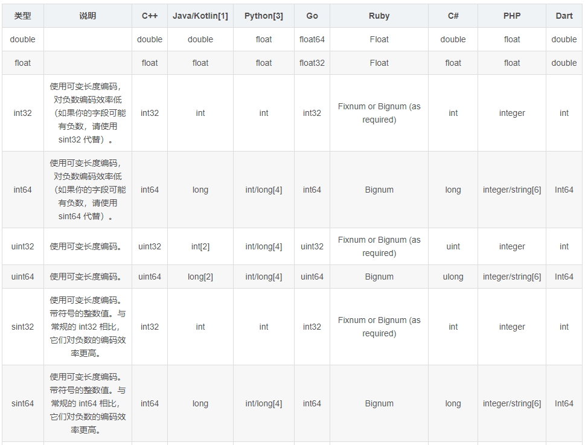

# protobuf

# 参考文章

* [官方文档](https://protobuf.dev/)
* [ProtoBuf 原理详解](https://blog.csdn.net/qq_34820803/article/details/107744123)
* [Protobuf是什么？](https://blog.csdn.net/Shockang/article/details/115739715)
* [一文读懂——Protobuf](https://blog.csdn.net/weixin_42905141/article/details/125272803)

# 概述

Google Protocol Buffer( 简称 Protobuf) 是 Google 公司内部的混合语言数据标准，被应用于RPC系统和持续数据存储系统。

Protocol Buffers 是一种轻便高效的结构化数据存储格式，可以用于**结构化数据串行化、或者说序列化**。它很适合做数据存储或RPC数据交换格式。可以用于即时通讯、数据存储等领域的语言无关、平台无关、可扩展的序列化结构数据格式。

Google的Protobuf了，相比于它的前辈xml、json，它的体量更小，解析速度更快，所以在 IM 这种通信应用中，非常适合将 Protobuf 作为数据传输格式。

protobuf的核心内容包括：

* 定义消息：消息的结构体，以message标识。
* 定义接口：接口路径和参数，以service标识。

通过protobuf提供的机制，服务端与服务端之间只需要关注接口方法名（service）和参数（message）即可通信，而不需关注繁琐的链路协议和字段解析，极大降低了服务端的设计开发成本。

## 优点

* **更小、更快**——Protobuf类似XML，不过它更小、更快。用户可以定义自己的数据结构，然后**使用代码生成器生成的代码来读写这个数据结构，甚至可以在无须重新部署程序的情况下更新数据结构**。

* **跨平台、跨语言**——只需使用 Protobuf对数据结构进行一次描述，即可利用各种不同语言或从各种不同数据流中对结构化数据进行轻松读/写。

* **向后兼容性好**——它有一个非常棒的特性，即“向后”兼容性好，人们不必破坏已部署的、依靠“老”数据格式的程序就可以对数据结构进行升级。这样就可以不必担心因为消息结构的改变而造成大规模的代码重构或者迁移。

* **语义更清晰**——Protobuf的语义更清晰，无须类似XML解析器的内容(因为Protobuf编译器会将.proto文件编译成对应的数据访问类，以对Protobuf数据进行序列化、反序列化操作)。

* **简单易学**——使用Protobuf无须学习复杂的文档对象模型。 Protobuf的编程模式比较友好、简单易学，同时它拥有良好的文档和示例。对于喜欢简单事物的人而言， Protobuf比其他技术更有吸引力。

## 缺点

* **无法表示复杂概念**——Protobuf与XML相比也有不足之处。它功能简单，却无法用来表示复杂的概念。

* **通用性不足**——XML已经成为多种行业标准的编写工具，而Protobuf只是Google公司内部使用的工具，在通用性上相差很多由于文本并不适合用来描述数据结构，所以Protobuf也不适合用来对基于文本的标记文档(如HTML)建模。

* **无法自解释**，可读性差——另外，由于XML具有某种程度上的自解释性，它可以被直接读取编辑。而Protobuf以二进制的方式存储，除非有proto定义，否则无法直接读出Protobuf的任何内容。

* **Protobuf3 之前只支持Java/Python/C++**，Protobuf3 以后开始支持 Go/Ruby/PHP 等。

## 封包解包原理

### Protobuf Encoding

Protobuf序列化后生成的二进制消息非常紧湊，这得益于 Protobuf来用了非常巧妙的 Encoding 方法。

在考察消息结构之前，首先介绍一个名为 Variant的术语。Variant是一种紧凑地表示数字的方法。它用一个或多个字节来表示一个数字，**值越小的数字使用越少的字节数**，这样就能减少用来表示数字的字节数。

消息经过序列化后会成为一个二进制数据流，该流中的数据为一系列的Key/Value对。采用这种Key/Value结构**无须使用分隔符来分割不同的Field？？？**。对于可选的 Field，如果消息中不存在该Field，那么在最终的 MessageBuffer中就没有该 Field。

这些特性都有助于减少消息本身的大小。

### Protobuf Decoding

首先来了解一下XML的封解包过程。XML需要先从文件中读取字符串，再转换为XML文档对象结构模型，然后再从XML文档对象结构模型中读取指定节点的字符串，最后将这个字符串转换成指定类型的变量。这个过程非常复杂，其中将XML文件转换为文档对象结构模型的过程通常需要完成词法、文法分析等大量消耗CPU的复杂计算。

反观 Protobuf，只需简单地将一个二进制序列按照指定的格式读取到C++对应的结构类型中即可，速度非常快。

## 思考

**ProtoBuf、XML、JSON** 三者放到一起去比较，应该区分两个维度。一个是**数据结构化**，一个是**数据序列化**。

* 数据结构化面向开发或业务层面，侧重人类可读性甚至有时会强调语义表达能力
* 数据序列化面向通信或存储层面，侧重效率和压缩

* XML、JSON
    * 数据结构化: XML 作为一种扩展标记语言，JSON 作为源于 JS 的数据格式，都具有数据结构化的能力。
    * 数据序列化: JSON、XML 可以直接被用来数据序列化，例如直接采用 JSON、XML 进行网络通信传输，此时 JSON、XML 就成了一种序列化格式，它发挥了数据序列化的能力。

* ProtoBuf
    * 数据结构化: 在 .proto 文件中，通过 message、import、内嵌 message 等语法来实现数据结构化，
    * 数据序列化: ProtoBuf 有着明显的优势，效率、速度、空间几乎全面占优

### 总结

* XML、JSON、ProtoBuf 都具有**数据结构化和数据序列化**的能力

* XML、JSON **更注重数据结构化**，关注人类可读性和语义表达能力。ProtoBuf **更注重数据序列化**，关注效率、空间、速度，人类可读性差，语义表达能力不足（为保证极致的效率，会舍弃一部分元信息）

* XML、JSON 的应用场景更为丰富，ProtoBuf 的应用场景更为明确。

## ProtoBuf3语法

### 定义消息

定义一个用户信息的消息 UserInfo，消息中需要包含用户 ID，用户名，性别，年龄。那么你需要在 .proto 文件中定义的消息如下所示：

```
syntax = "proto3";
message UserInfo
{
    uint64 id = 1;
    string name = 2;
    int32 sex = 3;
    int32 age = 4;
}
```

### 字段类型

而 message 后面跟的 UserInfo 是需要定义的消息名，其中有四个字段，每个字段都有一个类型和一个字段名。在这个例子中，所有的字段都是 Protobuf 标准中定义的类型，我们也可以为**某个字段指定复合类型**，也就是该字段的类型是自定义的另一个消息的类型。

### 字段编号

消息的定义中每个字段都有一个唯一的编号。这些字段编号用于在序列化后的二进制中标识您的字段，一旦某个编号已经被某个字段使用，就不应该再去更改。

Tag的取值范围最小是1,最大是229229-1,但但 19000~19999 是 protobuf 预留的，用户不能使用。

虽然 编号的定义范围比较大，但不同 编号也会对 protobuf 编码带来一些影响：

* 1 ~ 15：单字节编码
* 16 ~ 2047：双字节编码

使用频率高的变量最好设置为1~15，这样可以减少编码后的数据大小，但由于编号一旦指定不能修改，所以为了以后扩展，也记得为未来保留一些 1~15 的 编号。

### 增加更多消息类型

单个 .proto 文件中可以定义多个消息类型。这在定义相关联的多个消息中很有用——例如要定义与搜索消息SearchRequest 相对应的回复消息 SearchResponse，则可以在同一个 .proto 文件中增加它的定义：

```
/* SearchRequest represents a search query, with pagination options to
 * indicate which results to include in the response. */
​
message SearchRequest {
  string query = 1;
  int32 page_number = 2;  // Which page number do we want?
  int32 result_per_page = 3;  // Number of results to return per page.
}
​
message SearchResponse {
 ...
}
```
### 指定字段规则

消息的字段可以是一下规则之一：

* singular: 格式良好的消息可以有 0 个或 1 个该字段(但不能多于 1 个)。这是 proto3 语法的默认字段规则。
* repeated: 格式良好的消息中该字段可以重复任意次数（包括 0 次）。重复值的顺序将被保留。

在 proto3 中，标量数值类型的重复字段默认会使用 packed 压缩编码。

### 保留字段

在采取彻底删除或注释掉某个字段的方式来更新消息类型时，将来其他用户再更新该消息类型时可能会重用这个字段编号。后面再加载该 .proto 的旧版本时会引发好多问题，例如数据损坏，隐私漏洞等。一个防止该问题发生的办法是将删除字段的编号（或字段名称，字段名称会导致在 JSON 序列化时产生问题）设置为保留项 reserved。**protocol buffer 编译器在用户使用这些保留字段时会发出警告**。

```
message UserInfo
{
    reserved 1, 2, 3 to 4;
    reserved "id", "name";
}
```

### proto 的字段类型

proto 语法中的字段类型又称为 Scalar Value Types ，翻译过来为：标量值类型。

一个标量消息字段有自己的类型，如下给出了 .proto 文件中指定的类型，以及生成不同语言的相应类型：




待补充 [一文读懂——Protobuf](https://blog.csdn.net/weixin_42905141/article/details/125272803)

#### 默认值

在 proto2 中，提供了 default 选项，可以为某一字段指定值，proto3 中移除了 default 选项的语法，默认值只能根据字段的类型系统决定，也就是说默认值全部是约定好的。当消息被解析时，如果编码后的消息不包含一个特定的单数，解析对象中相应字段就会被设置为该字段的默认值，其默认值的类型如下：

|类型|默认值|
|---|---|
|字符串	|空字符串|
|字节	|空字节|
|bool	|false|
|数字类型	|0|
|枚举	|第一个定义的枚举值，必须是0|
|消息字段	|该字段不被设置，确切值与具体语言有关。|
|repeated字段	|默认是空，具体的语言一般是空列表|

## enum 枚举

当你定义一个消息类型时，你可能希望它的一个字段只具有预定义的值的列表中的一个。例如你想给每个 UserInfo 添加一个用户类型字段，用户类型可以是 NORMAL（普通用户）、PAYING（付费用户）、VIP（VIP 用户）等。你可以通过在你的 .proto 文件中添加一个枚举定义，并为每个可能的值添加一个常数来做到这一点。

下面我们添加一个 UserType的枚举，包含了一些枚举值，以及一个 UserType 类型的字段：

```
message RspUserInfo
{
    uint64 id = 1;
    string name = 2;
    int32 sex = 3;
    int32 age = 4;

    enum UserType //用户类型枚举
    {
        NORMAL = 0;
        PAYING = 1;
        VIP = 2;
    }
    UserType = 5; //用户类型
}
```

### 导入定义的proto消息

```
import "myproject/other_protos.proto"
```

### 嵌套类型

你可以在定义的消息类型中定义和使用其他消息类型，就像下面的例子一样，结果消息被定义在SearchResponse消息中：

```
message SearchResponse
{
    message Result
    {
        string url = 1;
        string title = 2;
        repeated string snippets = 3;
    }
    repeated Result results = 1;
}
```

如果你想在其父级消息类型中重复使用这个消息类型，引用它的格式是_Parent_._Type_。例如：

```
message SomeOtherMessage
{
    SearchResponse.Result result = 1;
}
```

##  更新消息类型

如果现有的消息类型不再满足你的所有需求，比如你希望消息里有一个额外的字段，但你仍然想要使用旧的格式创建代码，不要担心，**更新消息类型不会破坏你现有的任何代码**，只要记住以下几条规则：

1. 不要改变任何现有字段的字段号。

2. 添加的任何字段都应该是 optional 或 repeated 类型的，这意味着任何使用你的“旧”消息格式的代码系列化的消息可以被你新的代码解析，因为不会缺少任何 require 字段。同样新的代码创建的消息也可以被旧的代码解析，旧的二进制文件在解析时只忽略新字段。然而，未知的字段也不会被丢弃，如果消息后来被序列化，位置字段也会被一起序列化，所以消息被传递到新的代码中，新字段仍然可用。

3. 非 required 字段可以被删除，只要字段号不会再你更新的消息类型中再次使用。你可能想要重命名这个字段，或者加上前缀 OBSOLETE_，或者让这个字段号保留下来，这样你的 proto 的未来用户就不能意外的重复使用这个字段号。

4. 一个非 required 字段可以被转换成一个 extension 字段，反之亦然，只要类型和数字保持不变。

5. int32、uint32、int64、uint64 和 bool 都是兼容的，这意味着你可以将一个字段从这些类型中的一个改成另一个，而不会破坏向前或向后的兼容性。但是如果解析出的数字不符合相应的类型，将会进行截断，得到的结果不一定正确，比如 C++ 中，一个 64 位的数字被读作 int32，它将被截取为 32 位。

6. sint32 和 sint64 是相互兼容的，与其他整数类型不兼容。

7. string 和 byte 是兼容的，只要字节是有效的 UTF-8。

8. 如果 bytes 包含消息的编码版本，则嵌入的消息与 bytes 兼容。

9. 对于 string，bytes 和 message 字段，optional 与 repeated 兼容，给出的 repeated 字段的序列化数据作为输入，如果客户端期望这个字段是 optional 将采取最后的输入值，如果是 message 类型的字段，将合并所有的输入元素。注意，这对于数字类型，包括 bool 和 enum 通常是不安全的，数字类型的重复字段可以使用 packed 进行序列化，当期望有一个 optional 字段时，将不能被正确解析。

10. 改变一个默认值是允许的，只要你不会再网上发送，因此，如果一个程序收到一个没有设置特定字段的消息，该程序将看到默认值，因为它是在该程序的协议版本中定义的，而不会看到发件人代码中定义的默认值。

11. enum 兼容 int32、uint32、int64 和 uint64 （如果数值不合适，将会被截断），但是需要注意的是，如果消息被反序列化时，客户端代码可能会对他们进行不同的处理。值得注意的是，当消息被反序列化，未被识别的枚举值会被丢弃，这使得字段的访问器返回 false，其 getter 返回枚举定义中列出的第一个值，或者默认值。在重复枚举字段的情况下，任何未被识别的值都会从列表中剥离出来，然而，一个整数字段将始终保留其值，正因为如此，把一个整数升级为美剧时，需要非常小心，以免收到超界的枚举值。

12. 在现在 Java 和 C++ 的实现中，当未识别的枚举值被剥离出来时，它们会与其他的字段一起被存储，注意：如果这些数据被序列化，然后被识别这些值的客户端重新解析，可能导致奇怪的行为。在可选字段的情况下，即时在原始消息被反序列化后写了一个新的值，旧的值仍会被识别它的客户端读取。在重复字段的情况下，旧值将出现在任何已识别和新添加的值之后，这意味着顺序将不会被保留下来。

13. 将一个单一的 optional 字段值改成一个新的 oneof 成员时安全的，而且是二进制兼容的。将多个 optional 移动到一个新的 oneof 中可能是安全的，如果你确信没有代码同时设置多个字段的话。将任何字段移入一个现有的 oneof 是不安全的。

14. 在 map<K, V> 和相应的 repeated 消息字段之间改变是二进制兼容的（关于消息布局，看下文的 Maps）。然而，改变的安全性取决于应用：当反序列化和重新序列化消息时，使用 repeated 字段定义的客户端将产生一个语义上相同的结果，然而，使用 map 字段定义的客户端可能会重新排序条目并放弃有重复键的条目。

### Extensions扩展

extensions 允许你声明信息中的一系列字段编号可用于第三方扩展。扩展是一个字段的占位符，其类型没有被定义在源 .proto 文件中，这允许其他的 .proto 文件通过定义这些字段号的部分或全部字段的类型来增加你的消息定义。

看如下的实例：

```
message Foo
{
    // ...
    extensions 100 to 199;
}
```

这说明 Foo 中字段号 [100, 199] 的范围是保留给扩展的。其他用户现在可以在他们自己的 .proto 文件中向 Foo 添加新的字段，这些文件可以导入你的 .proto，使用你指定范围内的字段号，例如：

```
extend Foo
{
    optional int32 bar = 126;
}
```

这将在 Foo 的原始定义中添加一个名为 bar 的字段，字段号为 126。

当你的用户的 Foo 信息被编码时，其格式与用户在 Foo 内部定义新字段的情况完全相同。然而，你在应用程中访问扩展字段的方式与访问普通字段略有不同，你生成的数据访问代码有特殊的访问器用于处理扩展字段。

例如：在 C++ 中设置扩展字段 bar 的值：

```
Foo foo;
foo.SetExtension(bar, 15);
```

### Oneof

如果你有一个**有许多字段的信息，并且最多只能有一个字段会同时被设置**，你可以通过使用 oneof 功能来强制执行这一行为并节省内存。

oneof 字段和普通字段一样，只是 oneof 中所有字段共享内存，而且最多只能同时设置一个字段。设置 oneof 中的任何成员都会自动清除所有其他成员。你可以使用一个特殊的 case() 或 WhichOneof() 方法来检查 oneof 中的哪个值被设置（如果有的话），这取决于你选择的语言。

使用Oneof
```
message SampleMessage
{
    oneof test_oneof
    {
        string name = 4;
        SubMessage sub_message = 9;
    }
}
```

### 映射(map)

创建一个名为 projects 的映射，且每一个 string 对应一个 Project，你可以定义它如下：

```
map<string, Project> projects = 3;
```

### 包(package)

可以在 .proto 文件中添加一个可选的 package 指定器，以防止协议消息类型之间的名称冲突。

```
package foo.bar;
message Open
{
    //...
}

message Foo
{
    //...
    foo.bar.Open open = 1;
    //...
}
```

### 定义Services

如果你想在 RPC（远程过程调用）中使用你的消息类型，你可以在 .proto 文件中定义一个 RPC 服务接口，ProtoBuf 百年一起将用你选择的语言生成服务接口代码。举例来说，如果你想定义一个 RPC 服务的方法，该方法接受你的 SearchRequest 并返回 SearchResponse，可以在 .proto 文件中定义它，如下：

```
service SearchService
{
    rpc Search(SearchRequest) returns (SearchResponse);
}
```

通常与 ProtoBuf 一起使用的 RPC 系统是 gRPC：一个 google 开发的跨平台跨语言的开源 RPC 。gRPC 与 ProtoBuf 一起工作非常好，并且让你使用一个特殊的 ProtoBuf 编译器插件从你的 .proto 文件直接生成相关的 RPC 代码。

如果不想使用 gRPC，也可以用你自己的 RPC 来使用 ProtuBuf。同时也有一些第三方项目，为 ProtoBuf 开发 RPC 实现。

# examples下的demo使用

路径: build_lib\examples\examples\3partlib\protobuf

代码

```cpp
#include <iostream>
#include <fstream>
#include <string>
#include "person.pb.h"
#include "game.pb.h"
#include "google/protobuf/io/zero_copy_stream_impl.h"
#include "google/protobuf/text_format.h"

using namespace test1;
using namespace test2;

void test1Fun()
{
  Person p;
  p.set_name("test");
  p.set_id(100);
  p.set_email("a.iabc.com");

  //------------------将pb二进制信息保存到字符串
  std::string str;
  p.SerializeToString(&str);
  std::cout << "str: [" << str << "]" << std::endl;

  //------------------将pb文本信息写入文件
  std::ofstream fw;
  fw.open("./Person.txt", std::ios::out | std::ios::binary);
  google::protobuf::io::OstreamOutputStream *output = new google::protobuf::io::OstreamOutputStream(&fw);
  google::protobuf::TextFormat::Print(p, output);

  delete output;
  fw.close();

  //---------------------将pb文本信息保存到字符串
  std::string str1;
  google::protobuf::TextFormat::PrintToString(p, &str1);
  std::cout << "str1: [" << str1 << "]" << std::endl;

  //---------------------反序列化
  Person p1;
  p1.ParseFromString(str);
  std::cout << "name:" << p1.name() << ",email:" << p1.email() << ",id:" << p1.id() << std::endl;
}

int main()
{
  test1Fun();
  test2Fun();
  return 0;
}
```

执行结果:

```
[root@5d4b980baaa2 protobuf]# ./protobufTest
str: [
testd
a.iabc.com]
str1: [name: "test"
id: 100
email: "a.iabc.com"
]
name:test,email:a.iabc.com,id:100
nickname:dsw
coin:2000
time:2017/4/13 12:22:11 kill:0 dead:0 assist:0
time:2017/4/13 12:22:11 kill:4 dead:2 assist:5
time:2017/4/13 12:22:11 kill:8 dead:4 assist:10
time:2017/4/13 12:22:11 kill:12 dead:6 assist:15
time:2017/4/13 12:22:11 kill:16 dead:8 assist:20
```


